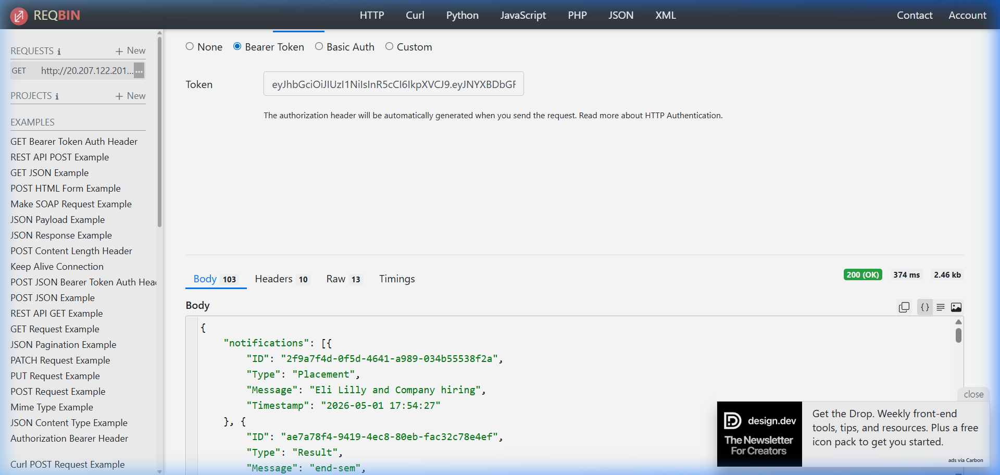

# Campus Notifications System - Frontend

A professional React.js application designed to manage and display campus-wide notifications with a focus on priority sorting, real-time API integration, and mandatory activity logging.

## 🚀 Features

- **Priority Inbox**: Automatically sorts and displays the top 10 most critical notifications (Placement > Result > Event).
- **Real-time API Integration**: Connects to the campus evaluation server to fetch live notifications.
- **Mandatory Logging Middleware**: Every user action (clicks, filters, page changes) is logged and reported to the server.
- **Dynamic Filtering**: Filter notifications by category (Placement, Result, Event, or All).
- **Pagination**: Efficiently browse through large numbers of notifications.
- **Read/Unread Tracking**: Visual indicators for seen and unseen messages.
- **Simple, Professional UI**: Built with Material UI for a clean, minimalist experience.

## 🛠️ Technology Stack

- **React.js**: Frontend framework.
- **Material UI (MUI)**: Professional component library.
- **Axios**: Handling API requests and middleware.
- **Environment Variables**: Secure storage for tokens and API URLs.

## 📁 Project Structure

```text
src/
├── api/             # API connection and request logic
├── components/      # UI components (List, Filter, Pagination, etc.)
├── middleware/      # Logging middleware for activity tracking
├── pages/           # Main page layout (Home.jsx)
├── utils/           # Sorting and priority logic
└── App.js           # Theme setup and entry point
```

## 📸 Screenshots

### API Testing (ReqBin/Postman)


## ⚙️ Setup & Installation

1. **Install Dependencies**:
   ```bash
   npm install
   ```

2. **Configure Environment Variables**:
   Create a `.env` file in the root directory and add your credentials:
   ```env
   REACT_APP_ACCESS_TOKEN=your_bearer_token_here
   REACT_APP_API_BASE_URL=/evaluation-service
   ```

3. **Run the Application**:
   ```bash
   npm start
   ```
   The app will run at [http://localhost:3000](http://localhost:3000).

## 📊 Development Phases

This project was built following a 10-phase assessment:
1. **Phase 1-2**: User Registration and Token Authentication.
2. **Phase 3**: Implementation of Logging Middleware.
3. **Phase 4**: Project Directory Structuring.
4. **Phase 5-6**: API Integration and Custom Priority Logic.
5. **Phase 7-8**: UI Component Development and Logging Integration.
6. **Phase 9-10**: Testing and Final Refinement.

---
**Developed by [Your Name/Roll No]**
